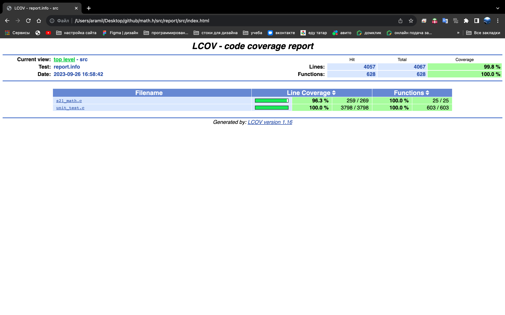

Собственная реализация математической библиотеки math.h в языке C

## Содержание
1. [Вступление](https://github.com/Aramil326/math.h#%D0%B2%D1%81%D1%82%D1%83%D0%BF%D0%BB%D0%B5%D0%BD%D0%B8%D0%B5)
2. [Информация](https://github.com/Aramil326/math.h#%D0%B8%D0%BD%D1%84%D0%BE%D1%80%D0%BC%D0%B0%D1%86%D0%B8%D1%8F)
3. [Part 1. Задание](https://github.com/Aramil326/math.h#part-1-%D0%B7%D0%B0%D0%B4%D0%B0%D0%BD%D0%B8%D0%B5)
4. [Part 2. Использование](https://github.com/Aramil326/math.h#part-2-%D0%B8%D1%81%D0%BF%D0%BE%D0%BB%D1%8C%D0%B7%D0%BE%D0%B2%D0%B0%D0%BD%D0%B8%D0%B5)
5. [Обзор некоторых функций "math.h"](https://github.com/Aramil326/math.h#%D0%BE%D0%B1%D0%B7%D0%BE%D1%80-%D0%BD%D0%B5%D0%BA%D0%BE%D1%82%D0%BE%D1%80%D1%8B%D1%85-%D1%84%D1%83%D0%BD%D0%BA%D1%86%D0%B8%D0%B9-mathh)
5. [Результаты тестов](https://github.com/Aramil326/math.h/blob/master/README.md#%D1%80%D0%B5%D0%B7%D1%83%D0%BB%D1%8C%D1%82%D0%B0%D1%82%D1%8B-%D1%82%D0%B5%D1%81%D1%82%D0%BE%D0%B2)

## Вступление

В данном проекте Нам предстояло разработать свою версию стандартной библиотеки math.h на языке программирования Си. Эта библиотека реализует базовые математические операции, которые затем используются в различных алгоритмах. В рамках выполнения этого проекта предполагалось знакомство с основами вычислительных методов и закрепление подходов структурного программирования.

## Информация

Математические операции в языке программирования C представлены группой функций, доступных в его стандартной библиотеке. Эти функции выполняют основные математические вычисления и операции. Все они оперируют с числами, имеющими плавающую точку. Стандарты языка C могут предоставлять различные наборы этих функций, но они обычно совместимы между собой. Если какие-либо из этих функций связаны с работой с углами, то для измерения угла используются радианы.

## Part 1. Задание

Реализовать функции библиотеки math.h

- Ваша библиотека должна быть написана на языке C11 и совместима с компилятором GCC.
- Код библиотеки должен располагаться в папке "src" в ветке "develop".
- Избегайте использования устаревших конструкций и функций, обратите внимание на пометки "legacy" и "obsolete" в официальной документации по языку и библиотекам. Ориентируйтесь на стандарт POSIX.1-2017.
- При написании кода соблюдайте стиль оформления кода, согласно Google Style.
- Оформите вашу библиотеку как статическую библиотеку и создайте заголовочный файл "s21_math.h".
- Придерживайтесь принципов структурного программирования и избегайте дублирования кода.
- Перед каждой функцией добавьте префикс "s21_".
- Создайте полное покрытие юнит-тестами для всех функций вашей библиотеки, используя библиотеку Check.
- Юнит-тесты должны проверять результаты вашей реализации путем сравнения их с реализацией из стандартной библиотеки "math.h".
- Юнит-тесты должны покрывать не менее 80% каждой функции.
- В цели "gcov_report" должен формироваться отчет gcov в виде HTML-страницы. Для этого, при запуске юнит-тестов, используйте флаги gcov.
- Подготовьте Makefile для сборки библиотеки и тестов, включая цели "all", "clean", "test", "s21_math.a" и "gcov_report".
- Запрещено копирование реализации и использование стандартной библиотеки "math.h" везде, кроме юнит-тестов.
- Обеспечьте соблюдение логики работы стандартной библиотеки, включая проверки, работу с памятью и поведение в нештатных ситуациях. Эти аспекты должны быть покрыты тестами.
- Общая проверяемая точность должна быть 16 значащих цифр, а точность дробной части - максимум 6 знаков после запятой.


## Part 2. Использование

<u> Все команды выполняются из директории src в терминале</u>  

Очищает объектные и прочие файлы, полученные во время выполнения других целей, и собирает статическую библиотеку:  
```makefile
make all
```

Собирает статическую библиотеку:  
```makefile
make s21_math.a
```

Запускает сборку тестов:  
```makefile
make test
```

Запускает проверку покрытия тестов и создание отчета:  
```makefile
make gcov_report
```

Очищает объектные и прочие файлы, полученные во время выполнения других целей:  
```makefile
make clean
```


## Обзор некоторых функций "math.h"

| №  | Функция                                    | Описание                                                           |
|----|--------------------------------------------|--------------------------------------------------------------------|
| 1  | `int abs(int x)`                           | вычисляет абсолютное значение целого числа                         |
| 2  | `long double acos(double x)`               | вычисляет арккосинус                                               |
| 3  | `long double asin(double x)`               | вычисляет арксинус                                                 |
| 4  | `long double atan(double x)`               | вычисляет арктангенс                                               |
| 5  | `long double ceil(double x)`               | возвращает ближайшее целое число, не меньшее заданного значения    |
| 6  | `long double cos(double x)`                | вычисляет косинус                                                  |
| 7  | `long double exp(double x)`                | возвращает значение e, возведенное в заданную степень              |
| 8  | `long double fabs(double x)`               | вычисляет абсолютное значение числа с плавающей точкой             |
| 9  | `long double floor(double x)`              | возвращает ближайшее целое число, не превышающее заданное значение |
| 10 | `long double fmod(double x, double y)`     | остаток операции деления с плавающей точкой                        |
| 11 | `long double log(double x)`                | вычисляет натуральный логарифм                                     |
| 12 | `long double pow(double base, double exp)` | возводит число в заданную степень                                  |
| 13 | `long double sin(double x)`                | вычисляет синус                                                    |
| 14 | `long double sqrt(double x)`               | вычисляет квадратный корень                                        |
| 15 | `long double tan(double x)`                | вычисляет тангенс                                                  |  


## Результаты тестов

Покрытие тестов:


